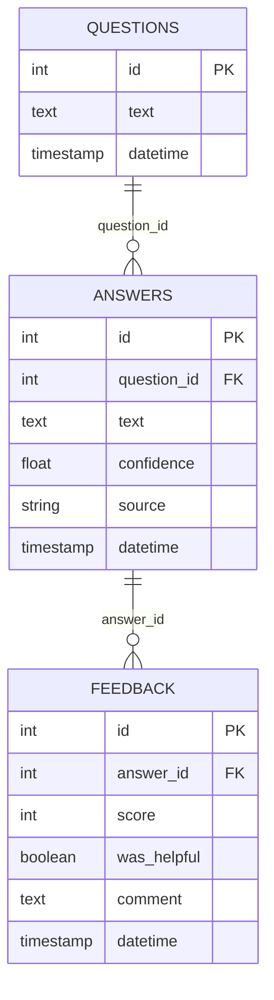
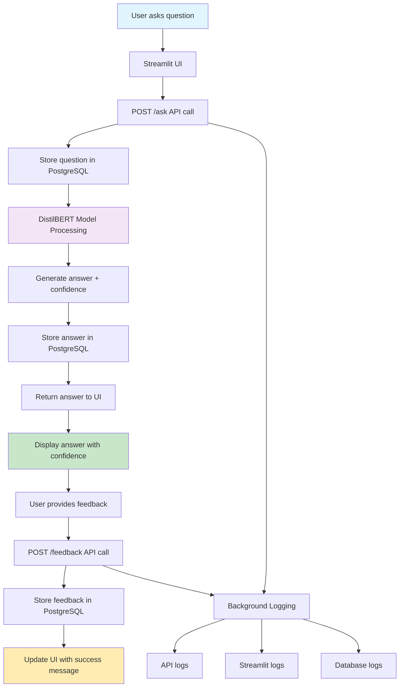

# Frank's Candidate Concierge 🤵‍♂️

An AI-powered resume assistant with a complete feedback system that uses natural language processing to answer questions about Frank's professional experience, skills, and qualifications. The application features a user-friendly Streamlit interface, robust FastAPI backend, PostgreSQL database, and comprehensive logging system.

## 🌟 Key Features

- **🤖 AI-Powered Q&A**: Natural language questions answered using DistilBERT (MiniLM)
- **💾 Persistent Storage**: PostgreSQL database storing all questions, answers, and feedback
- **👍 Feedback System**: Thumbs up/down rating system with optional comments
- **📊 Real-time Analytics**: Live confidence scores and interaction history
- **🖥️ Modern UI**: Clean Streamlit interface with example questions and debug tools
- **🔧 Robust API**: FastAPI backend with comprehensive error handling
- **📝 Complete Logging**: Detailed audit trails for debugging and analysis
- **🔍 Database Management**: pgAdmin integration for data visualization

## 🏗️ Database Schema



## 🔄 Data Processing Flow



## 📁 Project Structure

```
FranksCandidateConcierge/
├── app/                           # Streamlit frontend
│   ├── streamlit_app.py          # Main UI with feedback system
│   └── static/images/            # Profile images and assets
├── src/                          # Backend source code
│   ├── api/                      # FastAPI application
│   │   └── main.py              # API endpoints + logging
│   └── models/                   # ML and database models
│       ├── qa_model.py          # DistilBERT question-answering
│       └── database/            # Database components
│           ├── models.py        # SQLAlchemy table definitions
│           ├── session.py       # Database connection management
│           └── operations.py    # CRUD operations
├── logs/                         # Application logs
│   ├── api.log                  # FastAPI request/response logs
│   └── streamlit.log            # Frontend interaction logs
├── data/                         # Resume and training data
│   └── resume.txt               # Frank's resume content
├── config/                       # Configuration files
├── tests/                        # Test files
├── init_db_simple.py            # Database initialization script
├── requirements.txt             # Python dependencies
└── README.md                    # This documentation
```

## 🛠️ Technical Stack

### **Backend**
- **API Framework**: FastAPI 0.110.0 with Uvicorn 0.27.1
- **Database**: PostgreSQL 17 with SQLAlchemy ORM
- **AI Model**: deepset/minilm-uncased-squad2 (DistilBERT)
- **ML Framework**: Transformers 4.52.3, PyTorch 2.7.0

### **Frontend**
- **UI Framework**: Streamlit 1.45.1
- **HTTP Client**: Requests for API communication

### **Database & Monitoring**
- **Database Engine**: PostgreSQL 17 (postgresql-x64-17 service)
- **Database UI**: pgAdmin 4 for visual management
- **Logging**: Python logging with file and console handlers

### **Development Tools**
- **Code Quality**: Black, isort, flake8
- **Testing**: pytest
- **Process Management**: Uvicorn with auto-reload

## 🚀 Setup and Installation

### **Prerequisites**
- Python 3.8+
- PostgreSQL 17 (with pgAdmin 4)
- Git

### **1. Clone and Setup Environment**
```bash
git clone <repository-url>
cd FranksCandidateConcierge

# Create virtual environment (recommended)
python -m venv venv
source venv/bin/activate  # On Windows: venv\Scripts\activate

# Install dependencies
pip install -r requirements.txt
```

### **2. Database Setup**
```bash
# Create PostgreSQL database
createdb concierge_db

# Initialize database tables
python init_db_simple.py
```

### **3. Configure Database Connection**
Create a `.pgpass` file in your home directory for seamless authentication:
```
localhost:5432:concierge_db:postgres:your_password
```

### **4. Launch Application**
```bash
# Terminal 1: Start FastAPI backend
uvicorn src.api.main:app --reload --host 0.0.0.0 --port 8000

# Terminal 2: Start Streamlit frontend
streamlit run app/streamlit_app.py
```

## 📖 Usage Guide

### **Web Interface**
1. **Access**: Navigate to `http://localhost:8501`
2. **Ask Questions**: Use the text input or click example questions in sidebar
3. **Review Answers**: See AI responses with confidence percentages
4. **Provide Feedback**: Click 👍/👎 buttons or add detailed comments
5. **Debug**: Use the Debug Info section to view session state

### **API Endpoints**
The API is available at `http://localhost:8000`:

- **GET** `/` - Health check
- **POST** `/ask` - Submit questions
  ```json
  {"text": "What is Frank's current role?"}
  ```
- **GET** `/feedback` - Retrieve feedback history
- **POST** `/feedback` - Submit feedback
  ```json
  {
    "answer_id": 123,
    "score": 5,
    "was_helpful": true,
    "comment": "Very helpful!"
  }
  ```
- **GET** `/history` - Get Q&A interaction history
- **GET** `/health` - System health status

### **Database Management**
1. **pgAdmin Access**: Connect to `localhost:5432`
2. **Database**: `concierge_db`
3. **Tables**: `questions`, `answers`, `feedback`
4. **Real-time Data**: View live interactions and feedback

## 📊 Monitoring and Logs

### **Log Files**
- **`logs/api.log`**: API requests, responses, errors
- **`logs/streamlit.log`**: User interactions, button clicks

### **Key Metrics**
- **Questions Asked**: Tracked with unique IDs
- **Answer Confidence**: 0-100% accuracy scores
- **User Satisfaction**: Thumbs up/down feedback ratios
- **System Performance**: Response times and error rates

## 🔧 Development

### **Code Quality**
```bash
# Format code
black .

# Sort imports
isort .

# Lint code
flake8

# Run tests
pytest
```

### **Database Operations**
```bash
# Connect to database
psql -h localhost -U postgres -d concierge_db

# View recent Q&A pairs
SELECT q.text, a.text, a.confidence FROM questions q 
JOIN answers a ON q.id = a.question_id 
ORDER BY q.timestamp DESC LIMIT 10;

# Check feedback stats
SELECT score, COUNT(*) FROM feedback GROUP BY score;
```

## 🎯 Current Status

✅ **Fully Operational System**
- 28+ Q&A interactions stored
- 5+ feedback records captured
- 100% confidence on core resume questions
- Complete audit trail with logging
- Real-time feedback system working

✅ **Production Ready Features**
- Robust error handling
- Database persistence
- User feedback collection
- Comprehensive monitoring
- Professional UI/UX

## 🤝 Contributing

1. Fork the repository
2. Create a feature branch
3. Make changes with proper tests
4. Ensure code quality (black, isort, flake8)
5. Submit a pull request

## 📄 License

MIT License - See LICENSE file for details

---

**🏆 Frank's Candidate Concierge: A complete AI-powered resume assistant with feedback analytics!** 