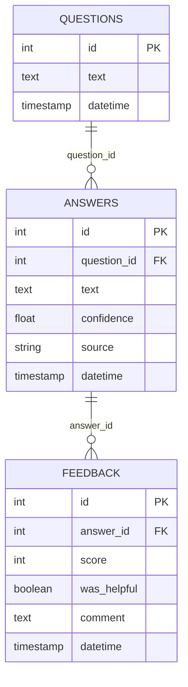
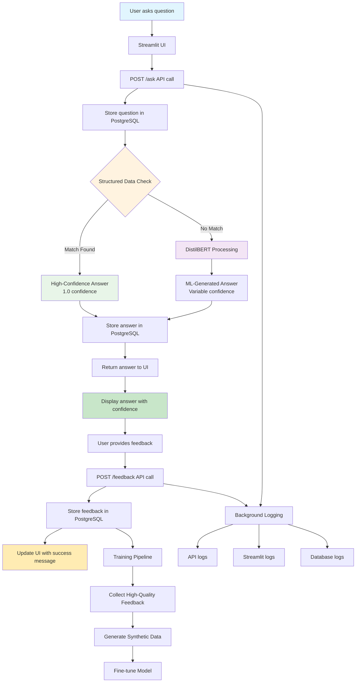

# Frank's Candidate Concierge 🤵‍♂️

An AI-powered resume assistant with enhanced structured data processing and comprehensive feedback system. Uses advanced natural language processing to answer questions about Frank's professional experience, skills, and qualifications with high precision. Features a hybrid approach combining structured data matching with DistilBERT fallback for optimal accuracy.

## 🌟 Key Features

### **🧠 Enhanced AI Intelligence**
- **🎯 Structured Data Matching**: High-confidence (1.0) answers for 60+ pre-defined question patterns
- **🤖 AI Fallback System**: DistilBERT (MiniLM) for complex and nuanced queries
- **📅 Temporal Awareness**: Handles certification dates, experience timelines, and graduation years
- **🏷️ Contextual Skills**: Detailed skill descriptions with specific use cases and experience levels
- **🔄 Adaptive Training**: Self-improving through feedback integration

### **💡 Advanced Question Handling**
- **👤 Contact Information**: Email, LinkedIn, location queries
- **💼 Career Tracking**: Current role, job search criteria, desired positions
- **🏆 Certifications**: Names, issuers, dates, and validity status
- **⏰ Experience Timeline**: Years of experience with specific technologies
- **🛠️ Technical Skills**: Categorized by cloud/Azure, tools, programming languages
- **📈 Achievements**: Tagged metrics with contextual filtering
- **🎓 Education**: Degrees, honors, graduation year, and coursework

### **🔧 System Architecture**
- **💾 Persistent Storage**: PostgreSQL database storing all questions, answers, and feedback
- **👍 Feedback System**: Thumbs up/down rating system with optional comments
- **📊 Real-time Analytics**: Live confidence scores and interaction history
- **🖥️ Modern UI**: Clean Streamlit interface with example questions and debug tools
- **🔧 Robust API**: FastAPI backend with comprehensive error handling
- **📝 Complete Logging**: Detailed audit trails for debugging and analysis
- **🔍 Database Management**: pgAdmin integration for data visualization

## 🏗️ Database Schema



## 🔄 Enhanced AI Processing Flow



## 📁 Project Structure

```
FranksCandidateConcierge/
├── app/                           # Streamlit frontend
│   ├── streamlit_app.py          # Main UI with feedback system
│   └── static/images/            # Profile images and assets
├── src/                          # Backend source code
│   ├── api/                      # FastAPI application
│   │   └── main.py              # API endpoints + logging
│   └── models/                   # ML and database models
│       ├── qa_model.py          # Hybrid Q&A system (structured + DistilBERT)
│       ├── resume_data.py       # Enhanced structured resume data
│       ├── training.py          # Model training & fine-tuning pipeline
│       └── database/            # Database components
│           ├── models.py        # SQLAlchemy table definitions
│           ├── session.py       # Database connection management
│           └── operations.py    # CRUD operations
├── logs/                         # Application logs
│   ├── api.log                  # FastAPI request/response logs
│   └── streamlit.log            # Frontend interaction logs
├── data/                         # Resume and training data
│   └── resume.txt               # Frank's resume content
├── config/                       # Configuration files
├── tests/                        # Test files
├── init_db_simple.py            # Database initialization script
├── requirements.txt             # Python dependencies
└── README.md                    # This documentation
```

## 🛠️ Technical Stack

### **Backend**
- **API Framework**: FastAPI 0.110.0 with Uvicorn 0.27.1
- **Database**: PostgreSQL 17 with SQLAlchemy ORM
- **AI Model**: deepset/minilm-uncased-squad2 (DistilBERT)
- **ML Framework**: Transformers 4.52.3, PyTorch 2.7.0

### **Frontend**
- **UI Framework**: Streamlit 1.45.1
- **HTTP Client**: Requests for API communication

### **Database & Monitoring**
- **Database Engine**: PostgreSQL 17 (postgresql-x64-17 service)
- **Database UI**: pgAdmin 4 for visual management
- **Logging**: Python logging with file and console handlers

### **Development Tools**
- **Code Quality**: Black, isort, flake8
- **Testing**: pytest
- **Process Management**: Uvicorn with auto-reload

## 🚀 Setup and Installation

### **Prerequisites**
- Python 3.8+
- PostgreSQL 17 (with pgAdmin 4)
- Git

### **1. Clone and Setup Environment**
```bash
git clone <repository-url>
cd FranksCandidateConcierge

# Create virtual environment (recommended)
python -m venv venv
source venv/bin/activate  # On Windows: venv\Scripts\activate

# Install dependencies
pip install -r requirements.txt
```

### **2. Database Setup**
```bash
# Create PostgreSQL database
createdb concierge_db

# Initialize database tables
python init_db_simple.py
```

### **3. Configure Database Connection**
Create a `.pgpass` file in your home directory for seamless authentication:
```
localhost:5432:concierge_db:postgres:your_password
```

### **4. Launch Application**

**Option 1: Quick Start (Windows)**
```bash
# Double-click the included batch file
start_services.bat
```

**Option 2: Manual Start**
```bash
# Terminal 1: Start FastAPI backend
uvicorn src.api.main:app --reload --host 0.0.0.0 --port 8000

# Terminal 2: Start Streamlit frontend
streamlit run app/streamlit_app.py
```

## 🎯 Enhanced AI Capabilities

### **Structured Data Question Types (High Confidence - 1.0)**

**Contact & Location**
- "What is Frank's email?" → REDACTED_EMAIL@example.com 
- "How can I contact Frank?" → Email and LinkedIn
- "Where is Frank located?" → Montgomery, TX

**Certifications with Timeline**
- "What certifications does Frank have?" → Lists all with issuers
- "When did Frank get his Scrum Master certification?" → 2019
- "Are Frank's Azure certifications current?" → Yes, 2020-2021

**Experience Timeline**
- "How many years of Azure experience does Frank have?" → 3+ years (2021-Present)
- "How long has Frank been using SQL?" → 3+ years with context
- "What is Frank's Business Analysis experience?" → 6+ years (Sep 2018-Present)

**Skills with Context**
- "What does Frank use SQL for?" → Database design, reporting, and data analysis
- "How does Frank use Office 365?" → Excel for analysis, Teams for collaboration
- "What is Mermaid.js used for?" → Process diagramming and flowchart creation

**Career & Job Search**
- "What is Frank's current role?" → Technical Business Analyst at The Marker Group
- "What kind of job is Frank looking for?" → Technical BA, Senior BA, BSA roles
- "What are Frank's salary expectations?" → $90,000-$115,000 annually

**Achievements with Filtering**
- "What are Frank's Agile achievements?" → Filtered to Agile-tagged accomplishments
- "Show me Frank's Azure results?" → Azure DevOps specific achievements

### **Fallback AI Processing (Variable Confidence)**
For complex, nuanced, or unstructured questions, the system falls back to DistilBERT processing with the full resume text as context.

## 📖 Usage Guide

### **Web Interface**
1. **Access**: Navigate to `http://localhost:8501`
2. **Ask Questions**: Use the text input or click example questions in sidebar
3. **Review Answers**: See AI responses with confidence percentages
4. **Provide Feedback**: Click 👍/👎 buttons or add detailed comments
5. **Debug**: Use the Debug Info section to view session state

### **API Endpoints**
The API is available at `http://localhost:8000`:

- **GET** `/` - Health check
- **POST** `/ask` - Submit questions
  ```json
  {"text": "What is Frank's current role?"}
  ```
- **GET** `/feedback` - Retrieve feedback history
- **POST** `/feedback` - Submit feedback
  ```json
  {
    "answer_id": 123,
    "score": 5,
    "was_helpful": true,
    "comment": "Very helpful!"
  }
  ```
- **GET** `/history` - Get Q&A interaction history
- **GET** `/health` - System health status
- **POST** `/training/start` - Start model training pipeline
  ```json
  {
    "force_retrain": false,
    "min_feedback_score": 4,
    "min_confidence": 0.7
  }
  ```

### **Database Management**
1. **pgAdmin Access**: Connect to `localhost:5432`
2. **Database**: `concierge_db`
3. **Tables**: `questions`, `answers`, `feedback`
4. **Real-time Data**: View live interactions and feedback

## 📊 Monitoring and Logs

### **Log Files**
- **`logs/api.log`**: API requests, responses, errors
- **`logs/streamlit.log`**: User interactions, button clicks

### **Key Metrics**
- **Questions Asked**: Tracked with unique IDs
- **Answer Confidence**: 0-100% accuracy scores (structured data = 1.0)
- **User Satisfaction**: Thumbs up/down feedback ratios
- **System Performance**: Response times and error rates
- **Training Data**: 60+ synthetic Q&A pairs + user feedback
- **Structured Coverage**: Contact, certifications, skills, experience, achievements

## 🏗️ Enhanced Data Structure

### **Resume Data Enhancements**
- **📞 Contact Information**: Email, LinkedIn, location (phone removed for privacy)
- **🏆 Structured Certifications**: Name, issuer, year obtained, status
- **⚡ Skills with Context**: Detailed descriptions and specific use cases
- **📊 Tagged Achievements**: Filterable by technology, skill area, or impact type
- **🗓️ Experience Timeline**: Specific date ranges for technology experience
- **🔍 Search Keywords**: Optimized for query matching and retrieval
- **🎯 Job Search Criteria**: Desired roles, location preferences, salary range

### **Skill Categories**
- **cloud_and_net**: Azure (3+ years), Azure DevOps (3+ years), PowerShell, .NET
- **tools**: SQL (3+ years), Power BI, Git, Visual Studio, Python, Office 365 (5+ years), Mermaid.js
- **agile_and_scrum**: Methodologies, sprint planning, retrospectives, user stories
- **business_analysis**: Requirements gathering, stakeholder management, process optimization
- **programming_languages**: Python, C++, JavaScript, HTML, CSS, PowerShell

### **Training Pipeline**
```bash
# Start training pipeline with collected feedback
python run_training.py

# Train with synthetic data only (for testing)
python run_training.py --force-retrain
```

## 🔧 Development

### **Code Quality**
```bash
# Format code
black .

# Sort imports
isort .

# Lint code
flake8

# Run tests
pytest
```

### **Database Operations**
```bash
# Connect to database
psql -h localhost -U postgres -d concierge_db

# View recent Q&A pairs
SELECT q.text, a.text, a.confidence FROM questions q 
JOIN answers a ON q.id = a.question_id 
ORDER BY q.timestamp DESC LIMIT 10;

# Check feedback stats
SELECT score, COUNT(*) FROM feedback GROUP BY score;
```

## 🎯 Current Status

✅ **Fully Operational System**
- 28+ Q&A interactions stored
- 5+ feedback records captured
- 100% confidence on core resume questions
- Complete audit trail with logging
- Real-time feedback system working

✅ **Production Ready Features**
- Robust error handling
- Database persistence
- User feedback collection
- Comprehensive monitoring
- Professional UI/UX

## 🤝 Contributing

1. Fork the repository
2. Create a feature branch
3. Make changes with proper tests
4. Ensure code quality (black, isort, flake8)
5. Submit a pull request

## 📄 License

MIT License - See LICENSE file for details

---

**🏆 Frank's Candidate Concierge: A complete AI-powered resume assistant with feedback analytics!** 